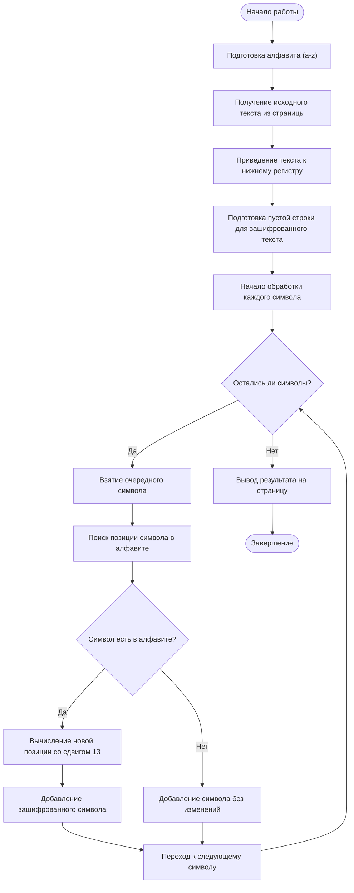

```mermaid
flowchart TD
    A([Начало работы]) --> B["Подготовка алфавита (a-z)"]
    B --> C["Получение исходного текста из страницы"]
    C --> D["Приведение текста к нижнему регистру"]
    D --> E["Подготовка пустой строки для зашифрованного текста"]
    E --> F["Начало обработки каждого символа"]
    F --> G{"Остались ли символы?"}
    G --> |Да| H["Взятие очередного символа"]
    H --> I["Поиск позиции символа в алфавите"]
    I --> J{"Символ есть в алфавите?"}
    J --> |Нет| K["Добавление символа без изменений"]
    J --> |Да| L["Вычисление новой позиции со сдвигом 13"]
    L --> M["Добавление зашифрованного символа"]
    M --> N["Переход к следующему символу"]
    K --> N
    N --> G
    G --> |Нет| O["Вывод результата на страницу"]
    O --> P([Завершение])
```