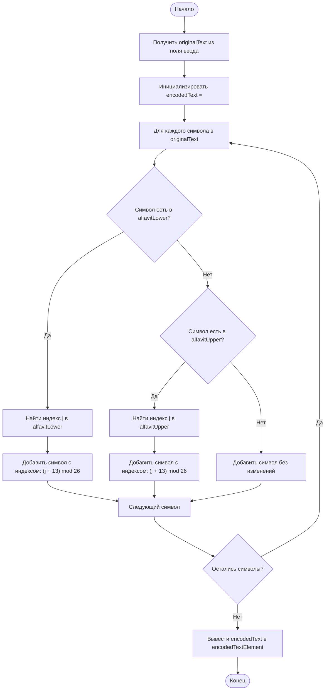

```mermaid
flowchart TD
    A([Начало]) --> B[Получить originalText из поля ввода]
    B --> C[Инициализировать encodedText = ""]
    C --> D[Для каждого символа в originalText]
    D --> E{Символ есть в alfavitLower?}
    E -- Да --> F[Найти индекс j в alfavitLower]
    F --> G["Добавить символ с индексом: (j + 13) mod 26"]
    G --> J[Следующий символ]

    E -- Нет --> H{Символ есть в alfavitUpper?}
    H -- Да --> I[Найти индекс j в alfavitUpper]
    I --> K["Добавить символ с индексом: (j + 13) mod 26"]
    K --> J

    H -- Нет --> L[Добавить символ без изменений]
    L --> J

    J --> M{Остались символы?}
    M -- Да --> D
    M -- Нет --> N[Вывести encodedText в encodedTextElement]
    N --> Z([Конец])
```